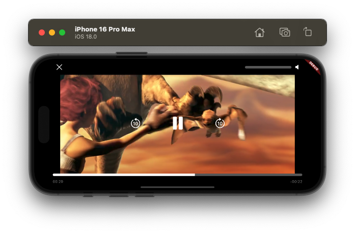

# VLC Player X

A powerful and customizable video player for Flutter, built for VLC.
**Inspired by the sleek and intuitive interface of Apple TV.**

---

## Preview


---

## Features

- **Play network and local videos:** Utilizes VLC for high compatibility.
- **Custom playback controls:** Includes Play/Pause, Seek, Volume, and Skip functionalities.
- **Gesture-based interactions:** Easily adjust volume and seek with swipe gestures.
- **Multiple aspect ratios:** Optimized for mobile.
- **Sleek UI inspired by Apple TV:** Enjoy a modern and intuitive user experience.


---

## Installation

Add this dependency to your `pubspec.yaml`:

```yaml
dependencies:
  vlc_player_x: ^1.1.0
```

---

## Usage Example

```dart
import 'package:flutter/material.dart';
import 'package:flutter_vlc_player/flutter_vlc_player.dart';
import 'package:vlc_player_x/vlc_player_x.dart';

void main() {
  runApp(const MyApp());
}

class MyApp extends StatelessWidget {
  const MyApp({super.key});

  @override
  Widget build(BuildContext context) {
    return MaterialApp(
      debugShowCheckedModeBanner: false,
      home: Scaffold(
        backgroundColor: Colors.black,
        body: Center(
          child: VlcPlayerX(
            aspectRatio: 16 / 9,
            controller: VlcPlayerController.network(
              'https://example.com/video.mp4',
              hwAcc: HwAcc.full,
              autoInitialize: true,
            ),
            onClose: () {
              print("Player closed!");
              Navigator.of(context).pop(); // Example: close the player screen
            },
          ),
        ),
      ),
    );
  }
}
```